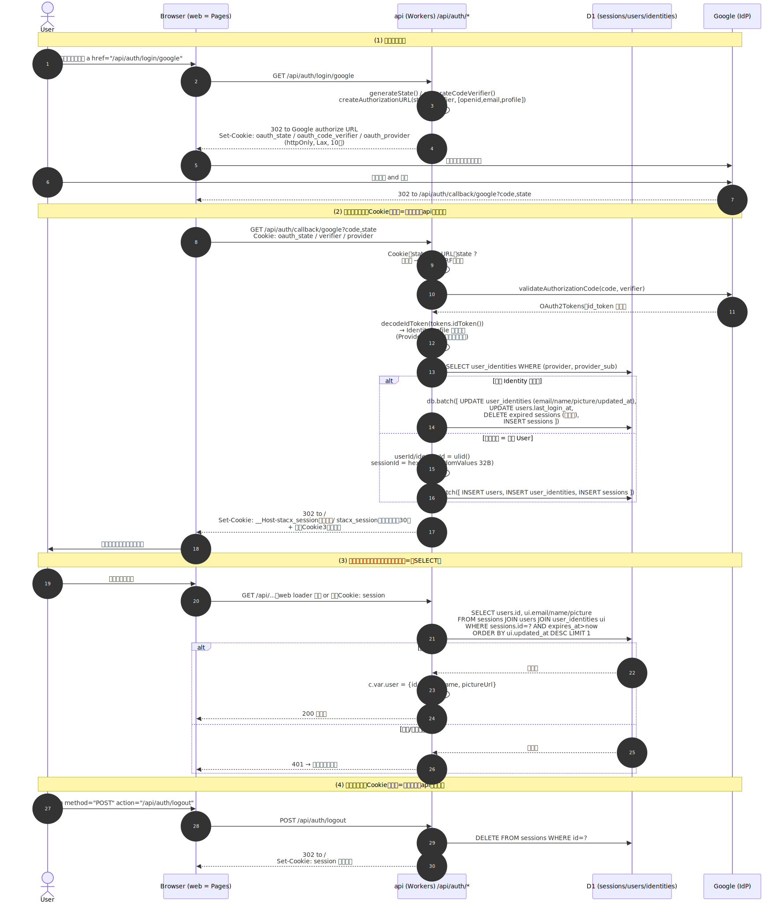

# 05. 認証設計（マルチ IdP 対応 OIDC / OAuth2）

## 概要

StacX は将来的に複数の IdP（Google / GitHub / Microsoft 等）に対応できるよう、**プロバイダ非依存な抽象化**を施した設計とします。

**Phase 1 では Google OIDC のみを実装**し、Phase 2 以降で GitHub などを追加します。設計（`Provider` 抽象 + `user_identities` テーブル）は最初から多 IdP 前提とし、Phase 2 で IdP を足すときはコード追加だけで済む状態を目指します。

セッションは **自前管理（D1 保存）** です。

---

## 採用ライブラリ

| ライブラリ | 用途 |
|---|---|
| **arctic** | OAuth2 / OIDC クライアント（多数のプロバイダ対応）。`generateState` / `generateCodeVerifier` / `validateAuthorizationCode` / `decodeIdToken` を利用 |
| **ulid** | `users` / `user_identities` の ID 採番（アプリ側で先に採番 → `db.batch` で複数文を1原子に畳める）|

セッション ID は Workers の CSPRNG（`crypto.getRandomValues` で 32 バイト）から直接引くため、トークン生成用の追加ライブラリは不要。

---

## 対応 IdP

### Phase 1（実装対象）

| IdP | 種別 | スコープ |
|---|---|---|
| Google | OIDC | `openid email profile` |

### Phase 2 で追加候補

| IdP | 種別 | スコープ |
|---|---|---|
| GitHub | OAuth2 + Email API | `read:user user:email` |
| Microsoft（Entra ID） | OIDC | `openid email profile` |
| Apple | OIDC | `name email` |
| GitLab | OIDC | `openid email profile` |

---

## Link 戦略

### Phase 1（個人利用）: 手動 Link のみ

- 初回ログイン: 新規 User 作成
- 既存 User が別 IdP を追加したい場合: ログイン状態で設定画面から「連携する」操作
- メール一致による **Auto-link は行わない**

### Phase 2（SaaS 化）: 業界標準ハイブリッド

- **検証済みメール**が既存 User と一致した場合: Auto-link（実行前に User に通知・確認画面表示）
- メール不一致 or 未検証メール: 新規 User 作成、設定画面から手動 Link 可能
- メール詐称対策のため、**信頼できる IdP（Google, GitHub 等）に限定**して Auto-link を発動

### Auto-link を発動しない（Phase 1 で除外する）ケース

- IdP がメールを返さない場合
- IdP がメールを `email_verified = false` で返した場合
- GitHub の `noreply` メール（`xxx@users.noreply.github.com`）

---

## DB スキーマ

### users（User 実体、ID とタイムスタンプのみ）

```typescript
{
  id: string              // ULID
  created_at: Date
  updated_at: Date
  last_login_at: Date     // ログイン履歴集計用
}
```

User には表示情報を持たせない。`name` / `email` / `picture_url` の Single Source of Truth は `user_identities` 側。

### user_identities（IdP との紐づけ = Identity、1 User : N Identity）

```typescript
{
  id: string              // ULID
  user_id: string         // FK → users.id
  provider: string        // IdP 識別子 "google" | "github" | ...
  provider_sub: string    // IdP 側の不変ユーザー ID（OIDC sub クレーム）
  email: string | null    // IdP からのクレーム
  email_verified: boolean // 〃 (Phase 2 Auto-link ゲート用)
  name: string | null     // 〃 (表示名)
  picture_url: string | null  // 〃
  created_at: Date
  updated_at: Date        // ログイン毎に更新 → 「最後に使った Identity」の根拠
}
// UNIQUE(provider, provider_sub)
```

表示情報を取り出すルール: User に紐づく `user_identities` のうち `updated_at` が最大の行を採用する。Phase 1 は 1 User : 1 Identity なので自明、Phase 2 で複数 Identity になっても「最後に使った IdP の情報」が自然に出る。

### sessions

```typescript
{
  id: string              // random 32 bytes hex
  user_id: string         // FK → users.id
  expires_at: Date
  created_at: Date
  user_agent: string | null
  ip_address: string | null
}
```

### 設計のポイント

- User は ID のみを持ち、表示情報 (email, name, picture_url) は `user_identities` を唯一の真実とする
- 一意性は `user_identities(provider, provider_sub)` で担保
- IdP 追加は `user_identities` にレコードを増やすだけ
- User 削除時は `user_identities` と `sessions` も CASCADE 削除

---

## 認証フロー詳細

### 全体シーケンス図



> 図のソースは [`docs/diagrams/auth-flow.mmd`](./diagrams/auth-flow.mmd)。編集したら次のコマンドで SVG を再生成する:
>
> ```sh
> pnpm dlx @mermaid-js/mermaid-cli -i docs/diagrams/auth-flow.mmd -o docs/diagrams/auth-flow.svg -p docs/diagrams/.puppeteer.json -b transparent
> ```
>
> 初回のみ、レンダリング用に ARM64 Chromium とその依存が必要（`.puppeteer.json` は machine 固有パスを含むため gitignore 済み・各自で作成）:
>
> ```sh
> pnpm dlx playwright install chromium          # ~/.cache/ms-playwright/ へ DL（sudo不要）
> sudo pnpm dlx playwright install-deps chromium # system 依存（実ターミナルで・要 sudo）
> CHROME=$(find ~/.cache/ms-playwright -name chrome -path '*chrome-linux*' | head -1)
> printf '{"executablePath":"%s","args":["--no-sandbox","--disable-setuid-sandbox"]}' "$CHROME" \
>   > docs/diagrams/.puppeteer.json
> ```

### 1. ログイン開始

```
GET /api/auth/login/:provider
```

- Phase 1 では `:provider` は `google` のみ。Phase 2 で `github` 等を追加
- `arctic` で `state` と（OIDC の場合）`codeVerifier` を生成
- httpOnly Cookie に一時保存（10 分有効）
  - `oauth_state`
  - `oauth_code_verifier`（OIDC 用、PKCE）
  - `oauth_provider`（コールバック時に判定するため）
- プロバイダの認可エンドポイントへ 302 リダイレクト

### 2. コールバック

```
GET /api/auth/callback/:provider?code=...&state=...
```

#### 共通処理
1. Cookie の `state` と URL の `state` を比較（CSRF 対策）
2. プロバイダ別の `Provider.verify(code, codeVerifier)` を呼び出す。トークン交換（`validateAuthorizationCode`）と、プロフィール取得を **Provider 内部に隠蔽**する。Google（OIDC）では `id_token` を `decodeIdToken` でデコードしてクレームを取り出す（userinfo エンドポイントは叩かない）。GitHub（Phase 2, OAuth2）では `access_token` で email API を叩く
3. `Provider.verify` は統一フォーマット `IdentityProfile` を返す（呼び出し側はトークンに触れない）

#### `IdentityProfile`（プロバイダ非依存の型）

```typescript
type IdentityProfile = {
  provider: ProviderId;         // IdP 識別子。Phase 1: "google"
  providerSub: string;          // IdP の sub クレーム
  email: string | null;
  emailVerified: boolean;
  name: string | null;
  pictureUrl: string | null;
}
```

#### User 判定ロジック（Phase 1）

```
1. user_identities で (provider, provider_sub) を検索
   ├─ ヒット → その User でログイン (既存 Session があれば破棄して新規発行)
   └─ ヒットせず → 新規 User 作成 + user_identities に INSERT
```

Phase 1 は IdP が 1 つ (Google) なので、UI から「別 IdP を追加する」フローが発火しない。callback で「ログイン中なら Link 追加」分岐は Phase 2 で導入する。

#### User 判定ロジック（Phase 2 で追加）

```
1.5. ログイン中（既存 Session あり）の場合:
   既存 User に Identity を追加 (Link)

2. 未ログイン かつ メール検証済み かつ 信頼 IdP の場合:
   user_identities.email で既存 User 検索
   ├─ ヒット → 「既存 User を発見しました。連携しますか？」確認画面 (Auto-link 提案)
   │              └─ User 承認 → Identity 追加
   └─ ヒットせず → 新規 User 作成
```

### 3. セッション発行

- `sessions` テーブルにレコード作成（User 判定の結果に応じた `db.batch` の一部として原子的に INSERT。詳細は [ADR 0004](./adr/0004-d1-batch-and-durable-objects-for-transactions.md)）
  - `id`: ランダム 32 バイト hex（`crypto.getRandomValues`）
  - `expires_at`: 30 日後
  - 同 batch 内で当該 User の期限切れ Session を `DELETE`（書き込みが起きる箇所への相乗り。ミドルウェアは write しない方針 [ADR 0003](./adr/0003-session-no-sliding.md) を侵さない）
- セッション ID を Cookie で発行
- `/` へリダイレクト

#### Cookie の仕様

| 属性 | 本番 | ローカル開発 |
|---|---|---|
| 名前 | `__Host-stacx_session` | `stacx_session` |
| 値 | セッション ID（32 バイト hex） | 同左 |
| HttpOnly | `true` | `true` |
| Secure | `true` | `false` |
| SameSite | `Lax` | `Lax` |
| Path | `/` | `/` |
| Domain | 指定しない | 指定しない |
| Max-Age | 30 日 | 30 日 |

本番では `__Host-` プレフィックスを付けることでブラウザに以下を強制させ、サブドメイン汚染や HTTPS 漏れを防ぐ:

- `Secure` 必須
- `Path=/` 必須
- `Domain` 指定不可（オリジン固定）

ローカル開発は `http://localhost` で `Secure` を付けられず `__Host-` も使えないため、プレフィックスなしの `stacx_session` を使う。Cookie 名は環境変数または `import.meta.env.PROD` 相当のフラグで切り替える。

Session の有効期限は **絶対 30 日固定**。スライディング延長は Phase 1 では入れない。利用頻度の高い個人ユーザーはほぼ毎回 30 日経過前に新規ログインで Session が再発行されるため、UX 上の不利益は実質ない。Phase 2 で利用頻度がまばらなユーザーが現れたタイミングで再検討する。

CSRF 対策は `SameSite=Lax` に依存し、Phase 1 で追加の CSRF トークンは発行しない。状態変更は POST/PUT/DELETE のみとする規約を守ることが前提。

### Set-Cookie の発行経路

Phase 1 で Session Cookie を **書き換える** エンドポイントは以下 2 つのみ:

| エンドポイント | 呼び出し方 |
|---|---|
| `GET /api/auth/callback/:provider` | IdP からのリダイレクト → ブラウザが直接 api に到達 |
| `POST /api/auth/logout` | ブラウザの `<form method="POST" action="/api/auth/logout">` で直接送信 |

いずれもブラウザが api を直接叩くため、`Set-Cookie` はそのままブラウザに届く。web の `loader` / `action` 経由の API 呼び出しは **データ取得専用** とし、Cookie 書き換えを発生させない。これにより `Set-Cookie` 転送ヘルパは不要になる。

### 4. リクエスト時の認証

- 認証ミドルウェアを保護ルートに適用
- Cookie からセッション ID を取得
- D1 で `sessions` を引き、有効性確認
- ユーザー情報を Hono の `c.var.user` に注入

### 5. ログアウト

```
POST /api/auth/logout
```

- セッションを D1 から削除
- Cookie を即時失効

Link / Unlink エンドポイントは Phase 2 で導入する。詳細は本ドキュメント末尾「Phase 1 → Phase 2 移行時の追加実装」を参照。

---

## プロバイダ抽象化

### ディレクトリ構成

```
packages/api/src/auth/
├── index.ts                    # 認証ミドルウェア、ルート登録
├── session.ts                  # セッション CRUD
├── providers/
│   ├── types.ts                # Provider インターフェース、IdentityProfile 型
│   ├── registry.ts             # プロバイダ一覧の集約
│   └── google.ts               # Google 実装
│   # github.ts 等は Phase 2 で追加
└── routes/
    ├── login.ts                # /api/auth/login/:provider
    ├── callback.ts             # /api/auth/callback/:provider
    └── logout.ts               # /api/auth/logout
    # link.ts は Phase 2 で追加
```

### Provider インターフェース

```typescript
type Provider = {
  id: ProviderId;
  createAuthorizationURL(state: string, codeVerifier: string): URL;
  // トークン交換 + プロフィール取得を内部に隠蔽し、正規化済みプロフィールだけ返す
  verify(code: string, codeVerifier: string): Promise<IdentityProfile>;
}
```

トークンを抽象の外に出さない 2 メソッド構成とする。`exchangeCode` + `fetchUserInfo` の 3 分割は、OIDC（id_token）と OAuth2（access_token + REST）でトークンの形・後処理が異なり共通 `TokenSet` 型が破綻するため採らない。

`ProviderId` は実装済みプロバイダの union 型（Phase 1: `"google"`、Phase 2 で `"github"` 等を追加）。

`codeVerifier` は Phase 1 では必須（Google は PKCE 必須）。PKCE を使わない IdP（GitHub 等）を足す Phase 2 で初めて、`usesPKCE` フラグや `codeVerifier` 任意化をインターフェースに導入する（先回りしない）。

### プロバイダ追加の手順（将来）

1. `providers/microsoft.ts` を新規作成し `Provider` を実装
2. `providers/registry.ts` に登録
3. 環境変数（Client ID/Secret）を追加
4. **既存コードの変更は不要**

---

## セキュリティ対策

| 対策 | 実装 |
|---|---|
| CSRF（state 検証） | OAuth `state` パラメータ、Cookie の SameSite=Lax |
| PKCE | OIDC（Google）では必須、`code_verifier` を Cookie に保存 |
| セッションハイジャック | httpOnly + Secure Cookie、HTTPS 必須 |
| トークン保護 | アクセストークン・ID トークンはサーバー側のみ、フロントに渡さない |
| セッション固定 | ログイン時に必ず新規セッション ID 発行、ログアウト時に削除 |
| 有効期限管理 | セッション 30 日、`state`/`code_verifier` Cookie 10 分 |
| メール詐称対策 | Phase 2 の Auto-link は `email_verified=true` かつ信頼 IdP のみ |
| 連携最終手段の保護 (Phase 2) | Unlink 時に最後のログイン手段を削除させない |

---

## 環境変数

### Phase 1（Google のみ）

```
# Google OIDC
GOOGLE_CLIENT_ID=...
GOOGLE_CLIENT_SECRET=...

# 共通
APP_BASE_URL=https://stacx.dev     # コールバック URL の基点
```

Session ID は Workers の CSPRNG (`crypto.getRandomValues`) から 32 バイトの乱数を直接引くため、`SESSION_SECRET` のようなシード値は不要。

コールバック URL:

```
{APP_BASE_URL}/api/auth/callback/google
```

### Phase 2 で追加（GitHub 例）

```
GITHUB_CLIENT_ID=...
GITHUB_CLIENT_SECRET=...
```

```
{APP_BASE_URL}/api/auth/callback/github
```

ローカル開発: `packages/api/.dev.vars` に記述（Git 管理外）
本番: `wrangler secret put` で登録

---

## IdP 別の注意点

### Google
- OIDC 準拠なので `arctic` の `Google` を使う
- `email_verified` を返してくれる
- スコープ: `openid email profile`

### GitHub
- 純粋な OAuth2（OIDC ではない）
- メール取得には別途 `GET https://api.github.com/user/emails` を呼ぶ必要あり
- ユーザーがメール非公開設定の場合、`noreply` メールが返る
  - Phase 2 の Auto-link 対象から除外する
- スコープ: `read:user user:email`

### 将来追加時のチェックリスト
- [ ] OIDC か OAuth2 か
- [ ] PKCE 必須か
- [ ] メールを返すか、検証済みフラグを返すか
- [ ] アクセストークンの有効期限とリフレッシュ可否
- [ ] レート制限

---

## エラーハンドリング

| ケース | 挙動 |
|---|---|
| `state` 不一致 | 400 Bad Request、ログイン画面へ |
| `code` 交換失敗 | 400 Bad Request、ログイン画面へ「再試行してください」 |
| IdP がメールを返さない（GitHub、Phase 2） | 新規 User は作成可、Auto-link は対象外 |
| 既に同じ IdP が Link 済み（Phase 2 Link 時） | 409 Conflict |
| 最後の Identity を Unlink しようとした（Phase 2） | 422 Unprocessable Entity |
| セッション切れ | 401 Unauthorized、ログイン画面へリダイレクト |

---

## Phase 1 → Phase 2 移行時の追加実装

DB スキーマは変更不要。以下のロジック・エンドポイント・UI を追加するだけで Phase 2 に移行可能。

### Link / Unlink エンドポイント

```
POST   /api/auth/link/:provider   # ログイン必須、設定画面から発火
DELETE /api/auth/link/:provider   # ログイン必須、最後の Identity は削除不可
```

- `POST` は通常のログインフローと同じ認可リダイレクト経路を辿るが、callback 時に「既存 User に Identity を追加」分岐 (Phase 2 User 判定ロジック 1.5) に入る
- 既に同じ IdP が Link 済みなら 409 Conflict
- Unlink 後にログイン手段がゼロになる場合は 422 Unprocessable Entity (「最後の Identity 保護」)

### Auto-link ロジック

1. **コールバック時の Auto-link ロジック**
   - メール検証済み + 信頼 IdP の場合に `user_identities.email` を検索 → Auto-link 確認画面
2. **Auto-link 確認画面の UI**（RR v7 側）
3. **Auto-link 実行 API**（Identity 追加 + 通知メール）
4. **メール通知機能**（SES や Resend 等を採用検討）

### その他

- 設定画面: 連携済み Identity 一覧 + Link / Unlink ボタン

---

## 関連ドキュメント

- `docs/03-architecture.md` - 全体構成・データフロー
- `docs/06-development.md` - 開発コマンド、Secret 管理
